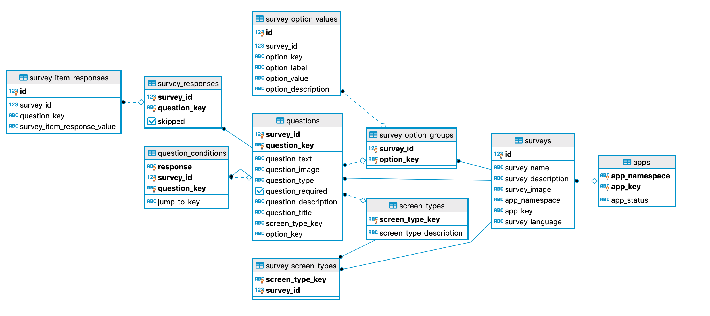

# Private Kit Service


## Configuration


## Maven Profiles

`spring.profiles.active=${ACTIVE_PROFILE:dev}`

There are three profiles used dev, prod , container.

_dev_ :      Used only for development without authentication enabled.

_prod_:      Authentication enabled

_container_: Used for docker-compose deployment 

# Authentication

Private-Kit Server uses anonymous authentication through Captcha token.

By default there is a Captcha implementation based on [HCaptcha](https://www.hcaptcha.com/)

IF you want to implement your own Captcha validation you have to re-implement the `com.privatekit.server.filter.CaptchaFilter`

## HCaptcha configuration

`captcha.site-key=${CAPTCHA_SITE_KEY:YOUR-SITE-KEY}`
`captcha.secret=${CAPTCHA_SECRET:YOUR-SECRET}`
`captcha.verify-url=${CAPTCHA_VERIFY_URL:https://hcaptcha.com/siteverify}`

# Database

# Metrics

Enable metrics on PrivateKit-Service is easy because it is using [spring-boot-starter-actuator](https://docs.spring.io/spring-boot/docs/current/reference/html/production-ready-features.html).
By default only the health endpoint is enabled: `/actuator/health` 

# Database
## Entity Relation Diagram

## PostgreSQL
Private-Kit Server expects a PostgreSQL database compatible with jdbc driver 42.2.X

The configuration is in the `src/main/resources/application.properties` Spring Boot Configuration file.
## Version Control
The database version control is performed by [Liquibase](https://www.liquibase.org/).

The root changelog file is located in `src/main/resources/db/changelog/changelog-master.xml`. From this one all other changelogs are imported. The first one has a sql reference for creating the hole schema.
## JPA
All JPA mappings are located in `com.privatekit.server.entity` package. 

The database has several relations but the mapping would contain only a few JPA Joins because of performance concerns.

For all interaction the choice is Spring Data repositories located in `com.privatekit.server.repository`

## Language Support 

Survey API supports store surveys in different languages. The API uses the standard HTTP Header _accept-language_ in order to determine the language to associate to thre survey.

For Example, POST a new survey

`
curl --location --request POST 'https://localhost:8080/v1.0/myNamespace/survey/' 
     --header 'Content-Type: application/json'
     --header 'Accept-Language: en'  
     --data-raw '{ ... }'
 `

The HTTP Header accept-language is **MANDATORY**. If the header is not present a HTTP Bad Request (400) will be returned.

## Testing
There are persistence tests in `com.privatekit.server.PrivateKitServicePersistenceTest` that use an H2 memory database to test almost all repository interactions.
 

# Compilation and Running

An `mvn` wrapper is bundled.

## To run server
```
./mvnw spring-boot:run
```

## To query local endpoint

```
curl localhost:8080
```

## Docker instructions

### Build Dockerfile
```
docker build -t privatekit/self-reporting-server .
```

### Run container
```
docker run -p 8080:8080 privatekit/self-reporting-server
```


